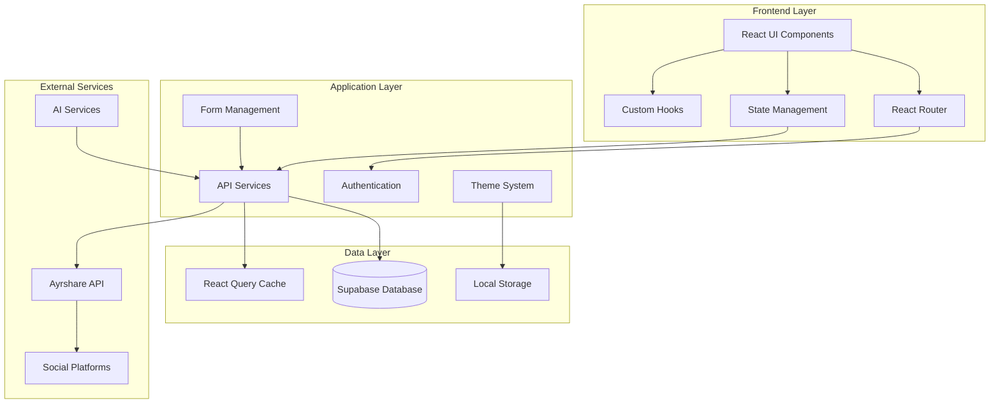

# System Architecture Documentation

## Overview

SocialAI Pro is built using a modern, scalable architecture that separates concerns between frontend presentation, backend services, and data management. The system is designed for high performance, maintainability, and extensibility.

## Architecture Diagram



## Frontend Architecture

### Component Hierarchy

```
App
├── ThemeProvider
│   ├── QueryClientProvider
│   │   ├── TooltipProvider
│   │   │   ├── BrowserRouter
│   │   │   │   ├── Routes
│   │   │   │   │   ├── Index (Main Layout)
│   │   │   │   │   │   ├── Navigation (Sidebar)
│   │   │   │   │   │   ├── Header (Top Bar)
│   │   │   │   │   │   └── Content
│   │   │   │   │   │       ├── Dashboard
│   │   │   │   │   │       ├── MainPage
│   │   │   │   │   │       │   ├── PostCreator
│   │   │   │   │   │       │   └── PostHistoryAndAnalytics
│   │   │   │   │   │       ├── TeamManagement
│   │   │   │   │   │       └── DashboardCustomization
│   │   │   │   │   └── NotFound
│   │   │   │   └── Toasters
```

### State Management Pattern

```typescript
// Global State Architecture
interface AppState {
  user: UserState
  posts: PostsState
  analytics: AnalyticsState
  team: TeamState
  theme: ThemeState
}

// Context Providers
<ThemeProvider>
  <QueryClientProvider>
    <AuthProvider>
      <App />
    </AuthProvider>
  </QueryClientProvider>
</ThemeProvider>
```

## Data Flow Architecture

### 1. User Interactions
```
User Action → Component Event → Hook/Service → API Call → Database Update → UI Refresh
```

### 2. Real-time Updates
```
Database Change → Supabase Realtime → React Query Invalidation → Component Re-render
```

### 3. Authentication Flow
```
Login Attempt → Supabase Auth → JWT Token → Secured API Access → User Context Update
```

## API Architecture

### REST Endpoints Structure

```typescript
// Posts API
GET    /api/posts              // Fetch user posts
POST   /api/posts              // Create new post
PUT    /api/posts/:id          // Update post
DELETE /api/posts/:id          // Delete post
POST   /api/posts/:id/schedule // Schedule post

// Analytics API
GET    /api/analytics          // Fetch analytics data
GET    /api/analytics/summary  // Analytics summary
POST   /api/analytics/track    // Track custom events

// Team API
GET    /api/team               // Fetch team members
POST   /api/team/invite        // Invite team member
PUT    /api/team/:id/role      // Update member role
DELETE /api/team/:id           // Remove team member

// AI API
POST   /api/ai/suggestions     // Get content suggestions
POST   /api/ai/optimize        // Optimize post content
POST   /api/ai/analyze         // Analyze post performance
```

### External API Integrations

```typescript
// Ayrshare API Integration
interface AyrshareAPI {
  post: (content: PostData) => Promise<PostResult>
  schedule: (content: PostData, date: Date) => Promise<ScheduleResult>
  analytics: (postId: string) => Promise<AnalyticsData>
  platforms: () => Promise<Platform[]>
}

// AI Service Integration
interface AIService {
  generateSuggestions: (context: string) => Promise<Suggestion[]>
  optimizeContent: (content: string) => Promise<OptimizedContent>
  analyzePerformance: (analytics: AnalyticsData) => Promise<Insights>
}
```

## Database Schema

### Core Tables

```sql
-- Users table (managed by Supabase Auth)
CREATE TABLE users (
  id UUID PRIMARY KEY DEFAULT uuid_generate_v4(),
  email VARCHAR(255) UNIQUE NOT NULL,
  created_at TIMESTAMP DEFAULT NOW(),
  updated_at TIMESTAMP DEFAULT NOW()
);

-- Posts table
CREATE TABLE posts (
  id UUID PRIMARY KEY DEFAULT uuid_generate_v4(),
  user_id UUID REFERENCES users(id),
  content TEXT NOT NULL,
  platforms TEXT[] NOT NULL,
  media_urls TEXT[],
  scheduled_at TIMESTAMP,
  published_at TIMESTAMP,
  status post_status DEFAULT 'draft',
  profile_key VARCHAR(255),
  created_at TIMESTAMP DEFAULT NOW(),
  updated_at TIMESTAMP DEFAULT NOW()
);

-- Analytics table
CREATE TABLE analytics (
  id UUID PRIMARY KEY DEFAULT uuid_generate_v4(),
  post_id UUID REFERENCES posts(id),
  platform VARCHAR(50) NOT NULL,
  views INTEGER DEFAULT 0,
  likes INTEGER DEFAULT 0,
  comments INTEGER DEFAULT 0,
  shares INTEGER DEFAULT 0,
  engagement_rate DECIMAL(5,2),
  recorded_at TIMESTAMP DEFAULT NOW()
);

-- Teams table
CREATE TABLE teams (
  id UUID PRIMARY KEY DEFAULT uuid_generate_v4(),
  name VARCHAR(255) NOT NULL,
  owner_id UUID REFERENCES users(id),
  created_at TIMESTAMP DEFAULT NOW()
);

-- Team members table
CREATE TABLE team_members (
  id UUID PRIMARY KEY DEFAULT uuid_generate_v4(),
  team_id UUID REFERENCES teams(id),
  user_id UUID REFERENCES users(id),
  role team_role DEFAULT 'viewer',
  invited_by UUID REFERENCES users(id),
  invited_at TIMESTAMP DEFAULT NOW(),
  joined_at TIMESTAMP,
  status member_status DEFAULT 'pending'
);

-- AI suggestions table
CREATE TABLE ai_suggestions (
  id UUID PRIMARY KEY DEFAULT uuid_generate_v4(),
  user_id UUID REFERENCES users(id),
  suggestion_type VARCHAR(50) NOT NULL,
  content TEXT NOT NULL,
  context JSONB,
  applied BOOLEAN DEFAULT FALSE,
  created_at TIMESTAMP DEFAULT NOW()
);
```

### Enums and Types

```sql
CREATE TYPE post_status AS ENUM ('draft', 'scheduled', 'published', 'failed');
CREATE TYPE team_role AS ENUM ('owner', 'admin', 'editor', 'viewer');
CREATE TYPE member_status AS ENUM ('pending', 'active', 'inactive');
```

## Security Architecture

### Row Level Security (RLS) Policies

```sql
-- Posts RLS - Users can only access their own posts or team posts
CREATE POLICY "Users can view own posts" ON posts
  FOR SELECT USING (
    user_id = auth.uid() OR
    user_id IN (
      SELECT tm.user_id FROM team_members tm
      WHERE tm.team_id IN (
        SELECT team_id FROM team_members
        WHERE user_id = auth.uid() AND status = 'active'
      )
    )
  );

-- Analytics RLS - Users can only view analytics for accessible posts
CREATE POLICY "Users can view own analytics" ON analytics
  FOR SELECT USING (
    post_id IN (
      SELECT id FROM posts
      WHERE user_id = auth.uid() OR user_id IN (
        SELECT tm.user_id FROM team_members tm
        WHERE tm.team_id IN (
          SELECT team_id FROM team_members
          WHERE user_id = auth.uid() AND status = 'active'
        )
      )
    )
  );
```

### Authentication & Authorization

```typescript
// Authentication layers
interface AuthLayer {
  supabaseAuth: SupabaseAuth       // Primary authentication
  jwtValidation: JWTValidator      // Token validation
  roleBasedAccess: RBACManager     // Role-based permissions
  rateLimiting: RateLimiter        // API rate limiting
}

// Permission matrix
const PERMISSIONS = {
  owner: ['all'],
  admin: ['create', 'read', 'update', 'delete', 'invite', 'manage_roles'],
  editor: ['create', 'read', 'update', 'delete'],
  viewer: ['read']
}
```

## Performance Architecture

### Caching Strategy

```typescript
// React Query configuration
const queryClient = new QueryClient({
  defaultOptions: {
    queries: {
      staleTime: 5 * 60 * 1000,      // 5 minutes
      cacheTime: 10 * 60 * 1000,     // 10 minutes
      refetchOnWindowFocus: false,
      retry: 3
    }
  }
})

// Cache invalidation patterns
const CACHE_KEYS = {
  posts: 'posts',
  analytics: 'analytics',
  team: 'team',
  suggestions: 'ai-suggestions'
}
```

### Code Splitting

```typescript
// Route-based code splitting
const Dashboard = lazy(() => import('./components/Dashboard'))
const PostCreator = lazy(() => import('./components/PostCreator'))
const TeamManagement = lazy(() => import('./components/TeamManagement'))

// Component-based code splitting for large features
const AnalyticsChart = lazy(() => import('./components/AnalyticsChart'))
```

## Scalability Considerations

### Horizontal Scaling
- **Database**: Supabase handles auto-scaling
- **API**: Stateless services can be load-balanced
- **Frontend**: CDN distribution for global performance

### Vertical Scaling
- **Memory optimization**: React.memo for expensive components
- **Bundle optimization**: Tree shaking and code splitting
- **Database optimization**: Proper indexing and query optimization

### Future Architecture Evolution

```typescript
// Microservices migration path
interface FutureArchitecture {
  authService: AuthenticationService
  postService: PostManagementService
  analyticsService: AnalyticsService
  aiService: AIContentService
  notificationService: NotificationService
}
```

## Monitoring & Observability

### Error Tracking
```typescript
// Error boundary implementation
class ErrorBoundary extends Component {
  componentDidCatch(error: Error, errorInfo: ErrorInfo) {
    // Log to monitoring service
    console.error('Application error:', error, errorInfo)
  }
}
```

### Performance Metrics
- **Core Web Vitals**: LCP, FID, CLS tracking
- **Bundle size monitoring**: Automated bundle analysis
- **API response times**: Query performance tracking
- **User engagement metrics**: Feature usage analytics

## Development Workflow

### Local Development
```bash
# Start development environment
npm run dev              # Frontend development server
npm run db:start        # Local Supabase instance
npm run test:watch      # Test runner in watch mode
```

### CI/CD Pipeline
```yaml
# Automated deployment pipeline
build:
  - Install dependencies
  - Run TypeScript checks
  - Run tests
  - Build production bundle
  - Deploy to staging
  - Run E2E tests
  - Deploy to production
```

This architecture provides a solid foundation for scaling the application while maintaining code quality, security, and performance standards.